## Steward's website (https://steward-fu.github.io/website/index.htm)
All of files or resources used on my website can be found from the following links.  

&nbsp;

[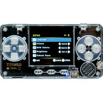](https://github.com/steward-fu/website/releases/tag/trimui)

[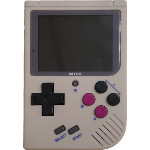](https://github.com/steward-fu/website/releases/tag/miyoo)

[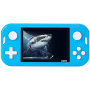](https://github.com/steward-fu/website/releases/tag/x350)

[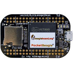](https://github.com/steward-fu/website/releases/tag/pocketbeagle)
[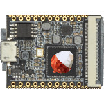](https://github.com/steward-fu/website/releases/tag/lichee-nano)
[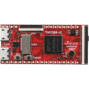](https://github.com/steward-fu/website/releases/tag/tiny200)
[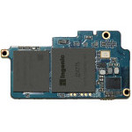](https://github.com/steward-fu/website/releases/tag/newton)
[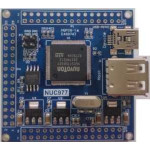](https://github.com/steward-fu/website/releases/tag/nuc977)
[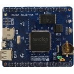](https://github.com/steward-fu/website/releases/tag/nuc972)

[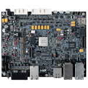](https://github.com/steward-fu/website/releases/tag/s32g399)
[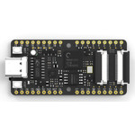](https://github.com/steward-fu/website/releases/tag/k210)
[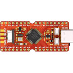](https://github.com/steward-fu/website/releases/tag/gd32vf103)
[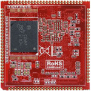](https://github.com/steward-fu/website/releases/tag/cm3354)
[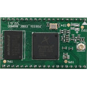](https://github.com/steward-fu/website/releases/tag/js9331)
[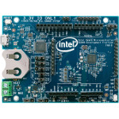](https://github.com/steward-fu/website/releases/tag/d2000)
[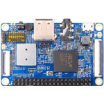](https://github.com/steward-fu/website/releases/tag/2g-iot)

[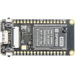](https://github.com/steward-fu/website/releases/tag/m1s-dock)

[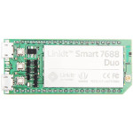](https://github.com/steward-fu/website/releases/tag/mt7688-duo)

[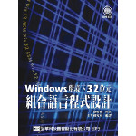](https://github.com/steward-fu/website/releases/tag/masm32)
[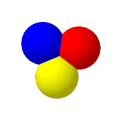](https://github.com/steward-fu/website/releases/tag/objasm)

[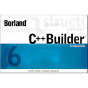](https://github.com/steward-fu/website/releases/tag/bcb6)

